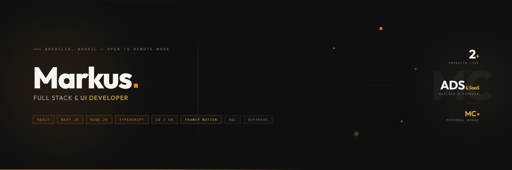

<br/>

```
Full Stack & UI Developer  ·  Brasília, Brasil  ·  Open to remote work
```

---

### About

I'm a Full Stack & UI Developer focused on building products that are technically solid and visually sharp. I work across the entire stack — from crafting pixel-precise interfaces to architecting backend logic and data layers.

I build with a product mindset: every project I take on is thought through from user experience to deployment. I'm currently developing my own SaaS products while taking on selected freelance projects.

All my **web projects and client work** are showcased at **[markuscorazzione.com.br](https://markuscorazzione.com.br)** — open-source and personal projects live here on GitHub.

> *"Good software is invisible. Great software feels inevitable."*

---

### Stack

**Frontend**


**Backend & Data**


**Tools & Platforms**


**Currently learning**


---

### Projects

<table>
<tr>
<td width="50%" valign="top">

**[SubsNuvem](https://github.com/corazzione)**
`SaaS` `Nuvemshop` `Node.js` `Supabase`

Recurring subscription management platform built natively for Nuvemshop stores. Handles billing cycles, plan control, and merchant dashboard.

*Status: in development*

</td>
<td width="50%" valign="top">

**[Portfolio & Web Projects](https://markuscorazzione.com.br)**
`React` `Framer Motion` `UI/UX`

All client work and web projects are listed at my portfolio site — from landing pages to full e-commerce builds.

*→ markuscorazzione.com.br*

</td>
</tr>
<tr>
<td width="50%" valign="top">

**More coming soon**
`Open source` `Apps` `Tools`

Building more products in public. Personal projects and tools will be posted directly here on GitHub.

</td>
<td width="50%" valign="top">

**Open to collaborations**
`Freelance` `Consulting` `Partnerships`

Have an idea or a product that needs to be built right? Let's talk.

</td>
</tr>
</table>

---

### GitHub Stats

<p align="left">
  
  
</p>

---

### Let's talk

I'm available for **freelance projects**, **technical consulting**, and **long-term collaborations**.

If you have a product idea or need someone who can handle both the code and the design — reach out.

[](https://markuscorazzione.com.br)
[](https://linkedin.com/in/corazzione)
[](https://wa.me/5561936182114)

---

<picture>
  <source media="(prefers-color-scheme: dark)" srcset="https://raw.githubusercontent.com/tobiasmeyhoefer/tobiasmeyhoefer/output/github-snake-dark.svg" />
  <source media="(prefers-color-scheme: light)" srcset="https://raw.githubusercontent.com/tobiasmeyhoefer/tobiasmeyhoefer/output/github-snake.svg" />
  
</picture>

<br/>

```
MC. — Markus Corazzione  ·  Building things that matter.
```
